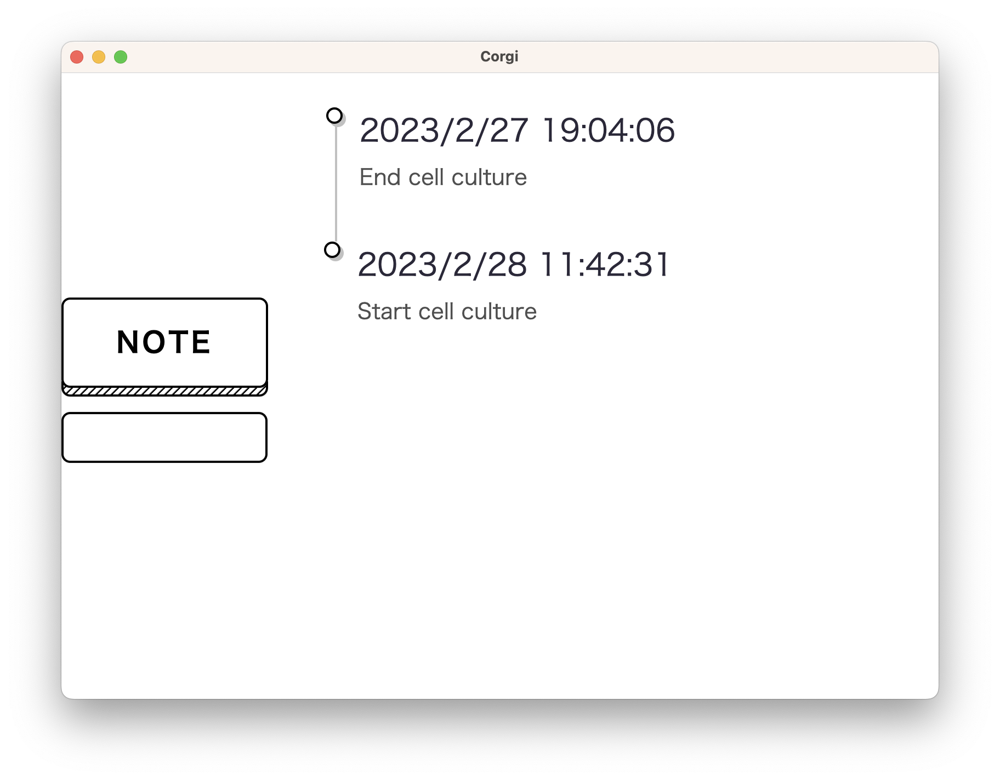

# Corgi



A simple application that records notes and time with a single click.

## Supported OS
It is developed using electron and should work on Windows, Linux, and Mac.

## Build
The distributed programs are not signed and may not run in some environments. In such cases, or if you want to use the latest version, please build the code yourself.

1. Install Node js.
2. Clone this repository.
```
git clone https://github.com/strelka145/Corgi.git
cd Corgi
```
3. Install modules.
```
npm install
npm install -g yarn
yarn add electron-builder --dev
```
4. Update the license list.
```
npm run licenses
```
5. Build. (For Linux, change --windows to --linux; for Mac, change --windows to --mac.)
```
npx electron-builder --windows --x64
```

This will create a built Corgi app in the dist folder.

## ToDo

- [ ] Exporting data.
- [ ] Edit notes.
- [ ] Synchronization using cloud services.
- [ ] Content Search.
